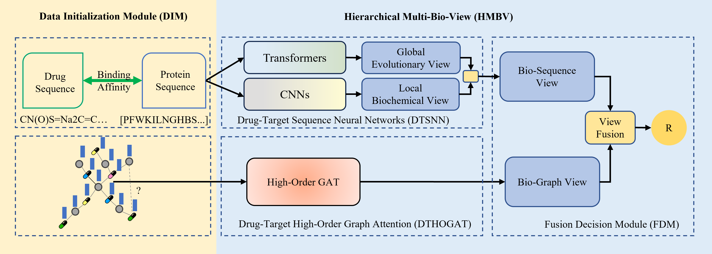

<h1 align="center">
HMBVIP: Hierarchical Multi-Bio-View Drug-Target Interaction Intelligent Prediction Networks
</h1>
<p align="center">


</p>
<p align="center">
 <br>
<b>Figure 1.</b> Structure of HMBVIP. The model comprises two core modules: 1) Data Initialization Module (DIM) processes drug and protein sequences, 2) Hierarchical Multi-Bio-View (HMBV) extracts drug-target features through multiple biological view, The HMBV module consists of three components: Drug-Target Sequence Neural Networks (DTSNN), Drug-Target High-Order Graph Attention (DTHOGAT), and Fusion Decision Module (FDM). 
</p>

## Conda Environment Setup
``` shell
conda create --name hmbvip --file ./requirements.txt
conda activate hmbvip
```

## Datasets
Here is the English translation of the introduction to **DAVIS**, **KIBA**, and **BindingDB**:

### **DAVIS Dataset**

- **Full Name**: Davis Kinase Binding Affinity Dataset  
- **Source**: Published by Davis et al. in a 2011 study ([Davis et al., Nature Biotechnology, 2011](https://www.nature.com/articles/nbt.1990)).
- **Contents**: Contains binding affinity data between 68 small-molecule inhibitors and 442 tyrosine kinases.
- **Measurement Metric**: Kd (dissociation constant, in nM), often converted to **pKd = -log10(Kd/1e9)** for modeling purposes.
- **Characteristics**:
  - The dataset is **dense**, meaning that most drug–target pairs have measured affinities.
  - Commonly used in deep learning models (e.g., DeepDTA, GraphDTA, MolTrans) to evaluate predictive accuracy on known drug-target interactions.


### **KIBA Dataset**

- **Full Name**: Kinase Inhibitor BioActivity Dataset  
- **Source**: Integrated from multiple sources (e.g., ChEMBL, BindingDB, DTC) by Tang et al., and widely used in DeepDTA (He et al., 2017).
- **Contents**: Includes affinity data for thousands of proteins and small molecules.
- **Measurement Metric**: **KIBA score**, a normalized fusion of multiple activity types (e.g., IC50, Ki, Kd), with higher values indicating stronger affinity.
- **Characteristics**:
  - Integrates diverse bioactivity data into a unified scoring system.
  - Larger in scale but more **sparse** than DAVIS.
  - Commonly used to test the generalization ability of deep learning models.


### **BindingDB**

- **Full Name**: Binding Database  
- **Website**: [https://www.bindingdb.org](https://www.bindingdb.org)
- **Contents**: A **public experimental database** of biomolecular binding affinities between chemical compounds and protein targets (mainly human proteins), including Ki, Kd, IC50, and more.
- **Data Size**: Over 2 million binding records covering tens of thousands of proteins and hundreds of thousands of compounds.
- **Characteristics**:
  - Open-access and continuously updated, suitable for real-world large-scale modeling.
  - Data come from diverse sources (literature, patents, etc.), so quality may vary and data cleaning is often necessary.
  - Frequently used as a raw data source for building training datasets in platforms like BioChem and DeepPurpose.


### Comparison Summary:

| Feature         | DAVIS             | KIBA               | BindingDB              |
|------------------|--------------------|----------------------|--------------------------|
| Data Type        | Experimental Kd     | Fused KIBA Score      | Experimental Kd/Ki/IC50  |
| Target Count     | 442                 | >2,000                | Tens of thousands        |
| Drug Count       | 68                  | Thousands             | Hundreds of thousands    |
| Data Density     | High (Dense)        | Medium (Sparse)       | Very Sparse              |
| Use Case         | Precision modeling  | Generalization testing | Real-world large-scale modeling |

### Load Dataset
```python
from tdc.multi_pred import DTI
davis = DTI(name = 'DAVIS')
kiba = DTI(name = 'KIBA')
bindingdb = DTI(name = 'BindingDB_Kd')
```

## Train

``` python
check_dir(base_path+"output/csv/")
check_dir(base_path+"output/log/")
check_dir(base_path+"output/pt/")
check_dir(base_path+"output/board/")
dataset_name = name
log_file = logger.add(f"{base_path}output/log/IPNet-{dataset_name}-{str(datetime.date.today())}.log")
df_split = load(name = dataset_name)
model = ipnet_train(df_split, dataset_name=dataset_name)
logger.remove(log_file)
```
output:
``` shell
IPNet-DAVIS.pt  IPNet-Graph-BindingDB_Kd.pt  IPNet-Graph-DAVIS.pt  IPNet-KIBA.pt  IPNet-Seq-DAVIS.pt
```

## Test
``` python
check_dir(base_path+"output/csv/")
check_dir(base_path+"output/log/")
check_dir(base_path+"output/pt/")
check_dir(base_path+"output/board/")
dataset_name = name
log_file = logger.add(f"{base_path}output/log/IPNet-{dataset_name}-{str(datetime.date.today())}.log")
df_split = load(name = dataset_name)
ipnet_test(df_split, dataset_name=dataset_name)
logger.remove(log_file)
```
output:

``` shell
drwxrwxr-x 2 yang yang     4096 Sep 12  2024 ./
drwxrwxr-x 6 yang yang     4096 Aug 30  2024 ../
-rw-rw-r-- 1 yang yang      186 Aug 29  2024 IPNet-DAVIS_Metrics_2024-08-29_12_48_23.csv
-rw-rw-r-- 1 yang yang      187 Aug 29  2024 IPNet-DAVIS_Metrics_2024-08-29_12_55_33.csv
-rw-rw-r-- 1 yang yang      190 Aug 30  2024 IPNet-DAVIS_Metrics_2024-08-30_02_45_12.csv
-rw-rw-r-- 1 yang yang      102 Aug 31  2024 IPNet-DAVIS_Metrics_2024-08-31_10_02_46.csv
-rw-rw-r-- 1 yang yang       88 Sep  2  2024 IPNet-KIBA_Metrics_2024-09-02_03_21_11.csv
```